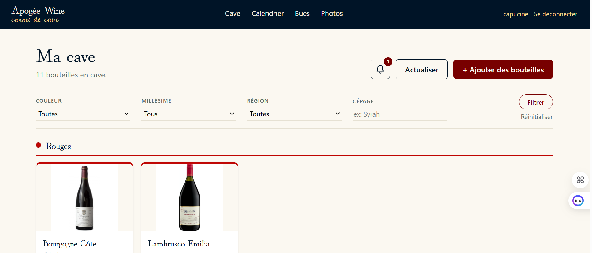
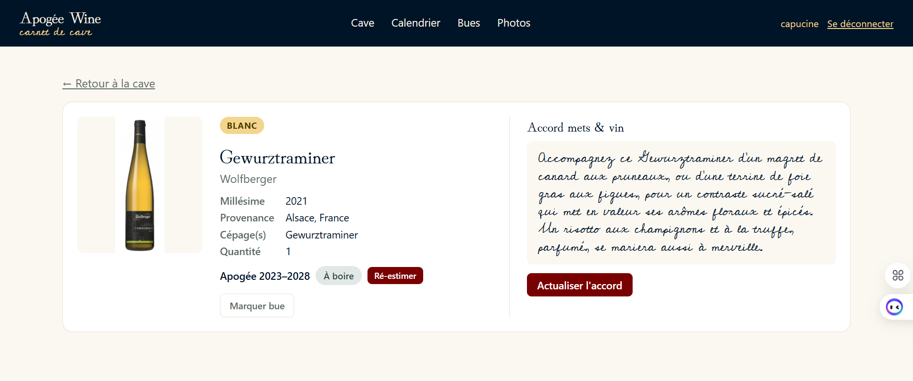
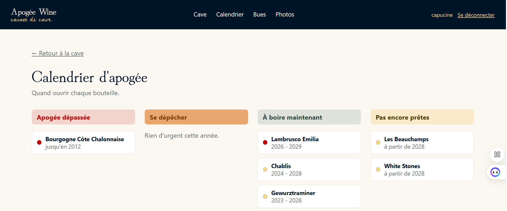

# Apogée Wine

Photographie ta cave, l'app s'occupe du reste : elle reconnaît chaque bouteille, te dit quand la boire et avec quoi, et te prévient avant qu'il ne soit trop tard.

## Fonctionnalités

- **Scanne, c'est rangé** — prends en photo une ou plusieurs bouteilles, l'IA les reconnaît et pré-remplit leur fiche
- **Le bon accord, sans y penser** — un accord mets/vin sur-mesure est suggéré automatiquement dès l'ajout
- **Jamais raté une fenêtre de tir** — chaque vin a sa fenêtre d'apogée, avec un calendrier qui dit quoi boire cette année, maintenant, ou plus tard
- **Une cave qui reste propre** — tri automatique par couleur, filtres fins (millésime, région, cépage), doublons fusionnés en un clic
- **Ta cave, rien qu'à toi** — un identifiant = une cave privée, invisible pour les autres

## Lancer le projet

```bash
pip install -r requirements.txt
```

Créer un fichier `.env` à la racine (voir `.env.example`) avec au minimum :

```
GROQ_API_KEY=ta_cle_groq
```

`APP_SECRET_KEY` (secret de signature des sessions) est optionnelle : une valeur par défaut est déjà prévue dans le code. À ne changer que si tu comptes partager ou déployer le projet.

Puis démarrer le serveur :

```bash
uvicorn main:app --reload
```

Ouvrir `http://localhost:8000`, se connecter avec l'identifiant de son choix (aucun mot de passe : la connexion sert uniquement à séparer les caves de chacun).

## Choix techniques

- **Backend** : FastAPI (routes synchrones sauf upload de fichiers)
- **Base de données** : SQLite en accès direct (module `sqlite3`, pas d'ORM)
- **Frontend** : Jinja2 + un peu de JS vanilla (pas de framework JS), CSS custom
- **IA (Groq)** :
  - `qwen/qwen3.8-27b` (vision) pour reconnaître les bouteilles sur une photo
  - `openai/gpt-oss-20b` (texte) pour l'accord mets et l'estimation d'apogée
- **Auth** : session signée (Starlette `SessionMiddleware`), pas de vrai mot de passe — volontairement factice
- **Multi-cave** : chaque identifiant a sa propre cave (colonne `proprietaire` en base) et son propre dossier de photos (`static/uploads/<identifiant>/`)

## Architecture

```
main.py          routes FastAPI (pages + actions)
database.py      accès SQLite (schéma, requêtes)
vision.py        appel Groq vision (analyse de photo)
conseils.py      appel Groq texte (accord mets, apogée)
enums.py         enums (Couleur, StatutBouteille)
templates/       pages Jinja2 (base.html + une page par écran)
static/style.css feuille de style
static/uploads/  photos importées, un sous-dossier par identifiant
cave.db          base SQLite (générée au démarrage, non versionnée)
```

Chaque bouteille appartient à un `proprietaire` (l'identifiant saisi à la connexion, normalisé). Toutes les requêtes de lecture/écriture sont filtrées par ce propriétaire, y compris l'accès direct à une bouteille par son URL.

## Aperçu

**Ma cave**


**Fiche bouteille**


**Calendrier d'apogée**

